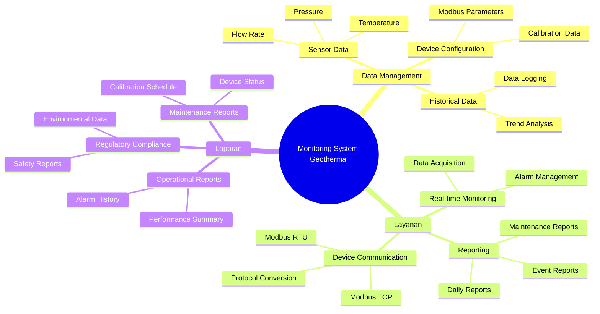

# Dokumen Visi Project: Monitoring Suhu dan Tekanan Geotermal (Modbus RTU/TCP)

## HISTORY REVISI

| Version | Date | Created By | Checked By | Approved By | Description |
|---------|------|------------|------------|-------------|-------------|
| 1 | 05 Juni 2025 | Hisam | Hisam | Hisam | First edition issued |

## PENDAHULUAN

PT Geothermal Energy Indonesia yang bertempat di Jl. Energi Terbarukan No. 15, Bandung saat ini sedang mengembangkan sistem monitoring terintegrasi untuk pembangkit listrik tenaga panas bumi. Salah satu program tersebut adalah sistem real-time monitoring suhu dan tekanan pada sumur produksi dan jaringan pipa distribusi geothermal.

## LATAR BELAKANG POSISI (PRODUK)

Saat ini sistem monitoring yang digunakan oleh PT Geothermal Energy Indonesia masih bersifat terpisah-pisah dan semi manual dengan pembacaan instrumentasi yang dilakukan secara berkala. Pada program pengembangan yang diinginkan, monitoring suhu dan tekanan diupayakan real-time dengan integrasi penuh melalui protokol Modbus. Permasalahan yang terjadi pada sistem saat ini adalah kurang akuratnya data real-time dan lambatnya response time untuk deteksi anomaly. Oleh karena itu dengan mengacu pada operasional sistem yang lama akan dibuat aplikasi baru yang diupayakan full monitoring terintegrasi.

## KUNCI SUKSES PRODUK

| High level Goal | Prioritas | Masalah dan Pertimbangannya | Solusi Saat ini |
|-----------------|-----------|-----------------------------|-----------------|
| Real-time monitoring | High | Sistem existing memiliki delay data 5-10 menit | Implementasi polling data setiap 1 detik |
| High reliability | High | Sering terjadi loss connection dengan perangkat field | Implementasi automatic reconnection mechanism |
| Data accuracy | High | Kalibrasi sensor tidak terintegrasi | Built-in calibration factor adjustment |
| Multi-protocol support | Medium | Perangkat field menggunakan Modbus RTU dan TCP | Dual protocol support dalam satu aplikasi |
| Alarm notification | High | Deteksi anomaly yang lambat | Threshold-based immediate alert system |

## USER DAN OPERATOR

User pada PT Geothermal Energy Indonesia meliputi : Field Operator (FO), Control Room Operator (CRO), Maintenance Engineer (ME), dan Plant Manager (PM).

## PERSPEKTIF PRODUK

Sistem Monitoring Suhu dan Tekanan Geotermal harus dapat memberikan layanan 24/7 sehingga aplikasi harus berbasis real-time data acquisition. Desain arsitektur jaringan dan hardware harus mendukung requirement industrial environment dengan kondisi temperature tinggi dan area remote. Desain aplikasi perlu adanya layanan yang berkaitan dengan koneksi terhadap perangkat field melalui Modbus RTU/TCP dan integrasi dengan SCADA system existing.

## SPESIFIKASI SISTEM

## ONLINE SYSTEM PADA:
- Monitoring real-time suhu sumur produksi
- Monitoring real-time tekanan pipeline distribusi
- Automatic alarm notification untuk parameter outside threshold
- Historical data trending dan analysis
- Remote device configuration dan calibration

## GLOSSARY

| Term | Definisi dan Informasi | Format | Validasi | Alias |
|------|------------------------|--------|----------|-------|
| RTU | Remote Terminal Unit, perangkat lapangan untuk akuisisi data | Modbus RTU | Alamat 1-247 | Remote Unit |
| TCP | Transmission Control Protocol untuk komunikasi jaringan | Modbus TCP | IP Address:Port | Ethernet |
| PTGEI | PT Geothermal Energy Indonesia | Kode perusahaan | 3 huruf + angka | Perusahaan |
| FO | Field Operator, teknisi lapangan | XXX-FO-ID | Huruf-Angka | Operator Lapangan |
| CRO | Control Room Operator, operator ruang kendali | XXX-CRO-ID | Huruf-Angka | Operator Kontrol |
| Temperature | Pembacaan suhu dari sensor geothermal | ###.## °C | Angka, desimal | Suhu |
| Pressure | Pembacaan tekanan dari sensor geothermal | ###.## bar | Angka, desimal | Tekanan |
| Modbus Address | Alamat perangkat dalam jaringan Modbus | 1-247 | Angka 1-247 | Slave ID |
| Holding Register | Register Modbus untuk data read/write | 0-9999 | Angka 0-9999 | HR |
| Input Register | Register Modbus untuk data read-only | 0-9999 | Angka 0-9999 | IR |

END OF DOCUMENT
