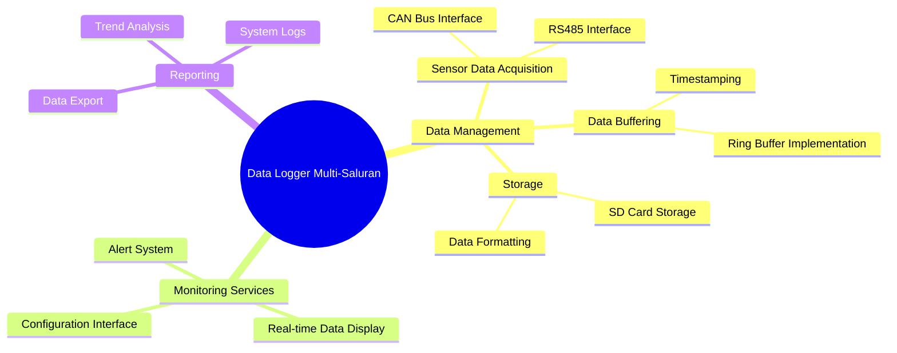

# DOKUMEN VISI PROJECT  
**DATA LOGGER SENSOR MULTI-SALURAN (CANOpen / RS485)**

---

## **HISTORY REVISI**

| Version | Date          | Created By | Checked By | Approved By | Description               |
|---------|---------------|------------|------------|-------------|---------------------------|
| 1       | 05 Juni 2025  | Hisam      | Hisam      | Hisam       | Edisi pertama diterbitkan |

---

## **PENDAHULUAN**

Perusahaan manufaktur "PT XYZ" yang berlokasi di Jl. Teknologi No. 10 Bandung saat ini sedang mengembangkan sistem monitoring kondisi lingkungan dan proses produksi secara real-time. Salah satu program tersebut adalah implementasi sistem data logging terpusat untuk mengumpulkan data dari berbagai sensor (aliran, suhu, kelembaban) yang tersebar di seluruh lini produksi.

---

## **LATAR BELAKANG POSISI (PRODUK)**

Saat ini sistem monitoring yang digunakan oleh PT XYZ masih bersifat terpisah-pisah dan semi-otomatis, dimana data dari masing-masing sensor harus dibaca secara manual dan dicatat secara periodik. Pada program pengembangan yang diinginkan, pembacaan data dari semua sensor akan dilakukan secara otomatis dan terpusat melalui interface CAN bus atau RS485. Permasalahan yang terjadi pada sistem saat ini adalah rentannya kehilangan data ketika jumlah sensor bertambah banyak dan tidak adanya timestamp yang konsisten untuk setiap pembacaan data. Oleh karena itu, dengan mengacu pada kebutuhan monitoring yang lebih handal, akan dikembangkan data logger multi-saluran yang mampu menangani banyak sensor sekaligus tanpa kehilangan data.

---

## **KUNCI SUKSES PRODUK**

| High level Goal              | Prioritas | Masalah dan Pertimbangannya                               | Solusi Saat ini                          |
|------------------------------|-----------|-----------------------------------------------------------|------------------------------------------|
| Robust, reliable, real-time  | High      | Data sering hilang ketika banyak sensor aktif bersamaan   | Pembacaan sensor dilakukan bergantian    |
| Tidak kehilangan data        | High      | Buffer terbatas menyebabkan overflow                      | Manual backup periodic                   |
| Timestamp akurat             | Medium    | Tidak ada timestamp yang konsisten antar sensor           | Pencatatan waktu manual                  |
| Kompatibilitas multi-protokol| Medium    | Hanya mendukung satu jenis interface komunikasi           | Menggunakan converter protocol           |

---

## **USER DAN OPERATOR**

User pada PT XYZ meliputi : Operator Produksi (OP), Maintenance Engineer (ME), Quality Control (QC), dan Production Manager (PM).

---

## **PERSPEKTIF PRODUK**

Data Logger Sensor Multi-Saluran harus dapat beroperasi secara kontinu 24/7 sehingga sistem harus dirancang dengan arsitektur yang robust. Desain hardware dan software harus mendukung kemampuan buffering data yang besar dan penyimpanan yang reliable ke SD card. Sistem perlu didukung oleh CANOpen stack (CANopenNode) dan manajemen buffer yang efisien untuk memastikan tidak ada data yang hilang bahkan pada kondisi beban puncak.

---

## **SPESIFIKASI SISTEM**

---

## **ONLINE SYSTEM PADA:**

- Monitoring real-time data sensor melalui antarmuka web
- Konfigurasi parameter sensor secara remote
- Alert notification via email/SMS ketika threshold terlampaui
- Backup data otomatis ke cloud storage

---

## **GLOSSARY**

| Term            | Definisi dan Informasi                                                                 | Format                          | Validasi         | Alias   |
|-----------------|----------------------------------------------------------------------------------------|---------------------------------|------------------|---------|
| CAN Bus         | Protokol komunikasi serial untuk perangkat embedded                                    | CAN 2.0A/B                      | Standard CAN     | CAN     |
| RS485           | Standard komunikasi serial differential untuk jarak jauh                               | EIA-485                         | Standard RS485   | MODBUS  |
| Ring Buffer     | Struktur data circular buffer untuk penyimpanan sementara                              | Byte array dengan pointer       | -                | Buffer  |
| Timestamp       | Waktu pencatatan data dengan presisi tinggi                                            | YYYY-MM-DD HH:MM:SS.mmm         | ISO 8601         | TS      |
| CANopenNode     | Open-source CANopen stack untuk perangkat embedded                                     | C library                       | -                | CANstack|
| SD Card         Media penyimpanan non-volatile untuk data logging                      | FAT32                           | Kapasitas > 4GB  | Storage |

---

**END OF DOCUMENT**
