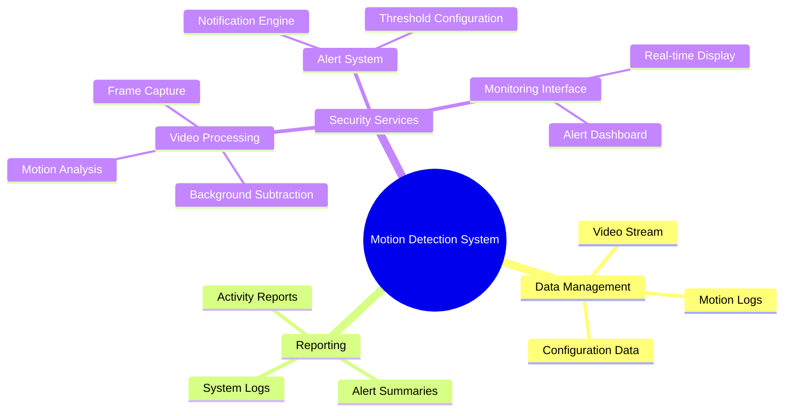

# DOKUMEN VISI PROJECT: PROGRAM MOTION DETECTION CCTV (BAHASA C)

## HISTORY REVISI

| Version | Date | Created By | Checked By | Approved By | Description |
|---------|------|------------|------------|-------------|-------------|
| 1.0 | 05 Juni 2025 | Hisam | Hisam | Hisam | First edition issued |

## PENDAHULUAN

Suatu perusahaan keamanan "SECUREGUARD" yang bertempat di Jl. Teknologi No. 15 Surabaya saat ini sedang mengupayakan program peningkatan sistem monitoring keamanan. Salah satu program tersebut adalah pengembangan sistem motion detection CCTV yang efektif dan efisien.

## LATAR BELAKKANG POSISI (PRODUK)

Saat ini sistem monitoring CCTV yang digunakan oleh "SECUREGUARD" masih bersifat pasif, yaitu hanya merekam dan menyimpan footage tanpa kemampuan deteksi gerakan otomatis. Pada program pengembangan yang diinginkan, sistem CCTV diupayakan dapat mendeteksi gerakan secara real-time dan memberikan notifikasi. Permasalahan yang terjadi pada aplikasi saat ini adalah ketidakmampuan dalam melakukan analisis video secara otomatis. Oleh karena itu dengan mengacu pada kebutuhan sistem keamanan modern, akan dibuat aplikasi motion detection yang dioptimalkan untuk performa tinggi.

## KUNCI SUKSES PRODUK

| High level Goal | Prioritas | Masalah dan Pertimbangannya | Solusi Saat ini |
|-----------------|-----------|-----------------------------|-----------------|
| Real-time processing | High | Processing video membutuhkan resource tinggi | Menggunakan algoritma efisien dalam C |
| Akurasi deteksi | High | False positive yang tinggi mengurangi kepercayaan sistem | Menggunakan kombinasi multiple detection method |
| Stabil 24/7 | High | Sistem harus berjalan terus menerus tanpa crash | Implementasi error handling dan recovery mechanism |
| Low latency | Medium | Delay deteksi mengurangi efektivitas sistem | Optimasi algoritma dan buffer management |

## USER DAN OPERATOR

User pada sistem "SECUREGUARD" meliputi: Security Officer (SO), System Administrator (SA), Monitoring Staff (MS), dan Management (MG).

## PERSPEKTIF PRODUK

Aplikasi Motion Detection CCTV harus dapat memberikan layanan monitoring 24 jam sehingga aplikasi harus berbasis real-time processing. Desain arsitektur sistem dan hardware harus mendukung kebutuhan processing video yang tinggi. Aplikasi perlu didesain dengan efisiensi memori dan CPU yang optimal mengingat proses video yang resource-intensive.

## SPESIFIKASI SISTEM

## ONLINE SYSTEM PADA:

- Layanan real-time motion detection (24/7 operation)
- Layanan alert notification via multiple channels
- Layanan monitoring dan configuration remote
- Layanan log recording dan reporting

## GLOSSARY

| Term | Definisi dan Informasi | Format | Validasi | Alias |
|------|------------------------|--------|----------|-------|
| Motion Detection | Proses identifikasi pergerakan dalam video stream | N/A | N/A | MD |
| CCTV | Closed-Circuit Television system | IP camera feed | Valid video stream | Camera |
| Frame | Satu gambar dalam sequence video | RGB/grayscale | 8-bit/24-bit pixel data | - |
| Background Subtraction | Teknik untuk memisahkan foreground objects | Matrix data | Numerical array | BGS |
| Security Officer | Staff yang bertugas memantau sistem keamanan | USER-ID | Alphanumeric, 8 chars | SO |
| Threshold | Nilai batas untuk deteksi gerakan | Float (0.0-1.0) | Decimal value | THRESH |

END OF DOCUMENT
